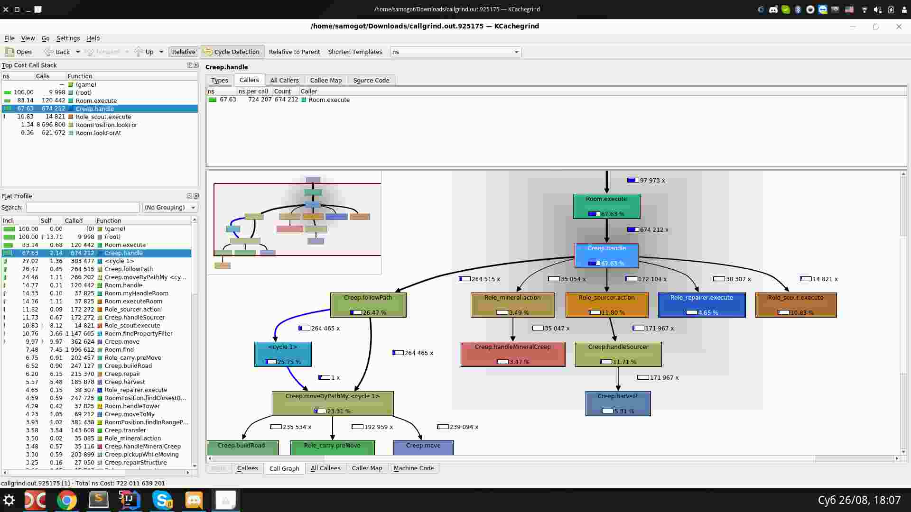

# Screeps Profiler [](https://github.com/screepers/screeps-profiler/actions/workflows/check.yml) [](https://coveralls.io/github/screepers/screeps-profiler)

The Screeps Profiler is a library that helps to understand where your CPU is being spent in the game of [Screeps](https://screeps.com).

It works by monkey patching functions on the Global game object prototypes, with a function that record how long each function takes.  The primary benefit of using this profiler is that you can get a clear picture of where your CPU is being used over time, and optimize some of the heavier functions.  While it works best for players that heavily employ prototypes in their code, it should work to some degree for all players.

## Setup

### Installation

You have two options for installing this script:
1. Install via a package manager such as npm: `npm install screeps-profiler`
2. Copy the `screeps-profiler.js` file directly into your project

### Wrap the loop function

After installing the script, update your `main` module to enable the profiler and integrate the profiler into your loop function.

**Example:**

```javascript
const profiler = require('screeps-profiler');

// This line monkey patches the game's prototypes and readies the profiler
// for use via `Game.profiler`.
// Any code that modifies the game's prototypes should be executed
// **before** this line
profiler.enable();

module.exports.loop = function() {
  profiler.wrap(function() {
    // Your loop function code goes here
  });
};
```

### Register code with the profiler

Finally, any code you wish to profile much be registered with the profiler. There are several options to register your code.

#### Registering code with the `@profile` decorator

If you use TypeScript (or JavaScript with decorator support), you can register classes and individual methods with the `@profile` decorator from `screeps-profiler/decorator`. This is equivalent to calling `registerClass` or `registerFN`, but keeps registration next to the code being profiled.

Load any module that uses `@profile` before calling `profiler.enable()`, the same as with manual registration.

TypeScript supports `@profile` in two modes:

- **Legacy decorators** — set `"experimentalDecorators": true` in your `tsconfig.json`
- **Standard decorators (TypeScript 5+)** — leave `experimentalDecorators` off (the default in newer TypeScript). Standalone functions can be registered with the same `profile` helper programmatically (see below).

##### Classes

Every method on the class is registered under the class name (for example, `SuperOmegaCreep.work`).

```typescript
import { profile } from 'screeps-profiler/decorator';

@profile
class SuperOmegaCreep {
  work() {
    hiddenManagersPlaybook.delegate();
  }
}
```

##### Methods

Only the decorated method is registered, using the method name as the label.

```typescript
import { profile } from 'screeps-profiler/decorator';

class GameHandler {
  @profile
  handleGame() {
    // do some work
  }
}
```

##### Accessor Properties

Decoration of class accessor properties (ex: `get myProperty()`) is not currently supported. If you wish to profile accessor properties, the only straightforward way to do so is to use `profiler.registerClass()` to profile every configurable method/property defined on the class.

##### Functions

TypeScript does not allow `@` decorators on function declarations, but `profile` can still be applied by invoking it as a function:

```javascript
import { profile } from 'screeps-profiler/decorator';

export const getAllScouts = profile(
  function getAllScouts() {
    return Object.keys(Game.creeps).filter((creepName) => {
      return Game.creeps[creepName].memory.role === 'scout';
    });
  },
  { kind: 'function', name: 'getAllScouts' },
);
```

With legacy decorators (`experimentalDecorators: true`), use `profiler.registerFN()` instead.

##### Disabling decorator registration

Call `configureProfileDecorator` before your decorated classes are defined to skip wrapping at decoration time. This is useful when you want decorators in source code but no registration overhead in production builds.

```typescript
import { configureProfileDecorator } from 'screeps-profiler/decorator';

configureProfileDecorator({ enabled: false });

// Or use a callback for dynamic control:
configureProfileDecorator({ enabled: () => Memory.profiling === true });
```

**Note:** `configureProfileDecorator` only controls whether `@profile` registers classes/functions when they are defined. You can still register those same classes/functions later on with `profiler.registerClass()` / `profiler.registerFN()`, then call `profiler.enable()` for the profiler to instrument whatever was registered.

#### Registering code without the `@profile` decorator

The profiler supports arbitrary registration of objects and functions as well. If you are not using the `@profile` decorator, you can register code manually by importing the profiler and calling `registerClass`, `registerObject`, or `registerFN`.

```javascript
const profiler = require('screeps-profiler');

class SuperOmegaCreep {
  work() {
    hiddenManagersPlaybook.delegate();
  }
}

// Each of the functions on this class will be replaced with a profiler wrapper. The second parameter
// is a required label.
profiler.registerClass(SuperOmegaCreep, 'SuperOmegaCreep');

const gameHandlerObject = {
  handleGame: () => {
    // do some work.
  }
};

// Each of the functions on this object will be replaced with a profiler wrapper. The second parameter
// is a required label.
profiler.registerObject(gameHandlerObject, 'gameHandlerObject');

function getAllScouts() {
  return Object.keys(Game.creeps).filter(creepName => {
    const creep = Game.creeps[creepName];
    return creep.memory.role === 'scout';
  });
}

// Be sure to reassign the function, we can't alter functions that are passed.
getAllScouts = profiler.registerFN(getAllScouts, 'mySemiOptionalName');
```

**Note:** The second param is optional if you pass a named function `function x() {}`, but required if you pass an anonymous function `var x = function(){}`. `profiler.Error` will be thrown when registering a function for which a name cannot be determined.

#### Registering custom game object prototype code

The profiler automatically registers most of the game API's functions when it
is enabled.

If your code [modifies any of the game's prototypes](https://docs.screeps.com/contributed/modifying-prototypes.html), `profiler.enable()` must be called **after** modifying all prototypes in order to ensure your custom properties are registered.

## Usage

### Console API

You can make use of the profiler via the Screeps console.

```javascript
Game.profiler.profile(ticks, [functionFilter]);
Game.profiler.stream(ticks, [functionFilter]);
Game.profiler.email(ticks, [functionFilter]);
Game.profiler.background([functionFilter]);
Game.profiler.callgrind(ticks, [functionFilter]);

// Output current profile data.
Game.profiler.output([lineCount]);
Game.profiler.downloadCallgrind();

// Reset the profiler, disabling any profiling in the process.
Game.profiler.reset();

Game.profiler.restart();
```


`profile` - Will run for the given number of ticks then will output the gathered information to the console.

`stream` - Will run for the given number of ticks, and will output the gathered information each tick to the console.  The can sometimes be useful for seeing spikes in performance.

`email` - This will run for the given number of ticks, and will email the output to your registered Screeps email address.  Very useful for long running profiles.

`background` - This will run indefinitely, and will only output data when the `output` console command is run.  Very useful for long running profiles with lots of function calls.

`callgrind` - Will run for the given number of ticks, and will download a file in Callgrind format which can be viewed in KCachegrind program.

`output` - Print a report based on the current tick.  The profiler will continue to operate normally.

`downloadCallgrind` - Download the callgrind report at the current tick.  The profiler will continue to operate normally.

`reset` - Stops the profiler and resets its memory.  This is currently the only way to stop a `background` profile.

`restart` - Restarts the profiler using the same options previously used to start it.

In each case, `ticks` controls how long the profiler should run before stopping, and the optional `functionFilter` parameter will limit the scope of the profiler to a specific function.

### Analyzing outputs

The profiler currently supports two output formats: plain text and callgrind.

#### Plain text format

The plain text format contains a table representing the call stack of the profiled code. The table contains the following columns:

* `calls`: The number of times each function was invoked while the profiler was running
* `time`: The total CPU consumed by each function (inclusive of all profiled callees) while the profiler was running
* `avg`: The average CPU used by each function (`time / calls`)
* `intents`: The number of intents registered by each function (inclusive of all profiled callees)
  * **WARNING:** The profiler is not able to determine when a registered intent from one API call replaces a previously-registered intent (ex: calling `Creep.move()` multiple times on the same creep can only register at most one intent). As such, the figures reported here should be treated as an upper bound.
* `function`: The names of each function

Below is a sample output of `Game.profiler.profile(1000)`

```
calls    time        avg       function
2000     12293.9     6.147     Room.work
10914    6025.0      0.552     Creep.work
2000     3534.5      1.767     Spawn.work
70000    1949.3      0.028     Structure.work
2832     1733.8      0.612     Creep.moveTo
3727     1093.7      0.293     Creep.moveToAndHarvest
1659     886.0       0.534     Creep.takeEnergyFrom
8466     871.9       0.103     Room.createConstructionSite
3500     852.7       0.244     Creep.harvest
975      745.8       0.765     Creep.deliverEnergyTo
2615     741.1       0.283     Room.needsCouriers
278      700.5       2.520     RoomPosition.findPathTo
278      673.6       2.423     Room.findPath
21342    575.4       0.027     Spawn.availableEnergy
2805     535.1       0.191     Room.getStorage
2108     511.7       0.243     Creep.move
1830     487.1       0.266     Creep.moveByPath
1439     483.9       0.336     Creep.moveToAndUpgrade
26596    454.5       0.017     Room.find
4247     443.1       0.104     Room.droppedControllerEnergy
Avg: 15.43 Total: 15425.31 Ticks: 1000 Est. Bucket (20 limit): 5055
```

Seeing that `Spawn.work` is high, we might run `Game.profiler.profile(200, 'Spawn.work')` to see what about `Spawn.work` is taking so long.  From that we would get:

```
calls    time        avg        function
62       137.7       2.221      Spawn.work
103      25.8        0.251      Room.needsCouriers
41       23.9        0.583      Room.needsUpgraders
41       18.6        0.452      Room.needsHarvesters
41       17.6        0.429      Room.getSourcesNeedingHarvesters
105      16.1        0.154      Room.getStorage
548      14.9        0.027      Spawn.availableEnergy
341      12.1        0.035      Room.find
62       8.4         0.135      Room.harvesterCount
48       8.3         0.174      Spawn.extend
211      7.9         0.037      Room.getExtensions
41       7.3         0.178      Room.droppedControllerEnergy
103      7.1         0.069      Room.courierCount
62       7.1         0.115      Room.getHarvesters
41       6.5         0.158      Room.needsBuilders
12       6.1         0.509      Spawn.buildBuilder
62       5.8         0.094      Room.setupFlags
103      5.6         0.055      Room.getCouriers
15       5.0         0.330      Room.upgraderWorkParts
41       4.8         0.116      Room.builderCount
Avg: 13.54 Total: 2707.90 Ticks: 200 Est. Bucket (20 limit): 1774
```

**Note:** Each function recorded here was part of a call stack with `Spawn.work` at the root.

Plain text outputs can be analyzed directly from the in-game console or notification emails, but it isn't possible to slice or drill down into contained data without rerunning the profiler with different filters.

#### Callgrind format

The callgrind format is an alternative text-based format. While it requires the use of a third-party tool to analyze effectively, it provides far more utility than the plain text format. Going back to the example from the "Plain text format" section, if the callgrind format were used instead, it wouldn't be necessary to run the profiler a second time to isolate `Spawn.work`.

The recommended way to analyze callgrind files is with a call graph viewer such as [KCachegrind](https://kcachegrind.github.io/html/Home.html).

If a pre-compiled Kcachegrind binary is not available for your platform and you do not wish to build it from source, there are [alternatives](https://valgrind.org/downloads/guis.html) that may be easier to set up.

On Windows, you can use [QCachegrind](https://sourceforge.net/projects/qcachegrindwin) to visualise the profiling result. That requires MSVC 2010 x86 redistributable, and download links in theREADME are outdated. You can get an official compatible redistributable [here](https://www.microsoft.com/en-us/download/details.aspx?id=26999).

On Windows, you can use [QCacheGrind](https://sourceforge.net/projects/qcachegrindwin) to visualise the profiling result. That requires MSVC 2010 x86 redistributable, and download links in readme are outdated. But you can get an official compatible redistributable [here](https://www.microsoft.com/en-us/download/details.aspx?id=26999).

Here is a sample callgrind output opened in [KCachegrind](https://kcachegrind.github.io/html/Home.html):



An alternative to a call graph viewer is to convert the callgrind output to a [DOT file](https://en.wikipedia.org/wiki/DOT_(graph_description_language)) using a tool such as [gprof2dot](https://github.com/jrfonseca/gprof2dot). The DOT file can then be visualized or converted into an image/PDF using [Graphviz](https://graphviz.org/).

The following "events" (stats) are reported in the callgrind format:
* Time (ns): Total CPU usage (in nanoseconds)
* Intent Time (ns): Additional CPU usage from registered intents (in nanoseconds)
  * Each intent adds 200,000 ns (0.2 CPU) to the total cost
  * Equivalent to `200000 * Registered Intents`
* Overhead Time (ns): The difference between Time and Intent Time (in nanoseconds)
* Registered Intents: The number of intents registered (the number of Intent Function Calls that returned an `OK` result)
  * **WARNING:** The profiler is not able to determine when a registered intent from one API call replaces a previously-registered intent (ex: calling `Creep.move()` multiple times on the same creep can only register at most one intent). As such, the figures reported here should be treated as an upper bound.
* Intent Function Calls: The number of calls made to game API functions that can register intents

**Note:** CPU usage in this format is measured in nanoseconds. `1 Screeps CPU unit = 1 ms = 1,000,000 ns`.

For more details on the callgrind file format, see the [Callgrind Format Specification](https://valgrind.org/docs/manual/cl-format.html).

## Overhead

At a high level, `screeps-profiler` works by wrapping/monkeypatching every
profiled function with code that checks whether or not the profiler is active.
While profiling, these wrapped functions measure the CPU used before and after
the wrapped function is called. CPU usage and other profiling metadata is then
recorded in memory before returning the result to the caller.

In addition to this, the `wrap` function applied to your game loop function
performs a small amount of work at the start of every tick by initializing some high-level profiler state and defining the `Game.profiler` object whenever
profiling is enabled.

When used judiciously to profile only functions that do significant amounts of
work, the overhead imposed by the profiler is non-trivial, especially when
it is not enabled. If you are profiling entire classes that include
simple, frequently-invoked methods/properties, however, this overhead can become
non-trivial.

The most straightforward way to reduce overhead is to ensure that only
significant functions are being profiled. Rather than profiling entire classes,
it may be more efficient to profile specific methods on those classes.

Another method to reduce overhead is to avoid calling `profiler.enable()` until
you need to use the profiler. If you don't want to push a code change every
time you want to disable/enable the profiler, you can assign the enable
method to the global namespace:

```javascript
global.enableProfiler = profiler.enable;
```

Then, you can manually enable it by calling `enableProfiler()` from the console.

Profiling overhead can be avoided entirely by performing all profiler setup
conditionally at init time. For example:

```javascript
// main.js:
import profiler from 'screeps-profiler';

function profilerWrapper(loopFn) {
  // Define the conditions under which the profiler should be enabled here:
  if (Memory.enableProfiler) {
    return loopFn;
  }

  // Register all profiled functions/objects/classes here. For example:
  // profiler.registerClass(SuperOmegaCreep, 'SuperOmegaCreep');

  // Enable profiler and monkeypatch the loop function
  profiler.enable();
  return () => { profiler.wrap(loopFn) };
}

export const loop = profilerWrapper(() => {
  // Your loop code goes here
});
```

Note that this approach requires a global reset to toggle the profiler on or off.
For example, to enable the profiler using the previous example, run this console commands:

```javascript
Memory.enableProfiler = true;
```

After the memory change is applied:
```javascript
Game.cpu.halt();
```

If you are using the `@profile` decorator instead of the `profiler.register`
functions, see the "Disabling decorator registration" section.
